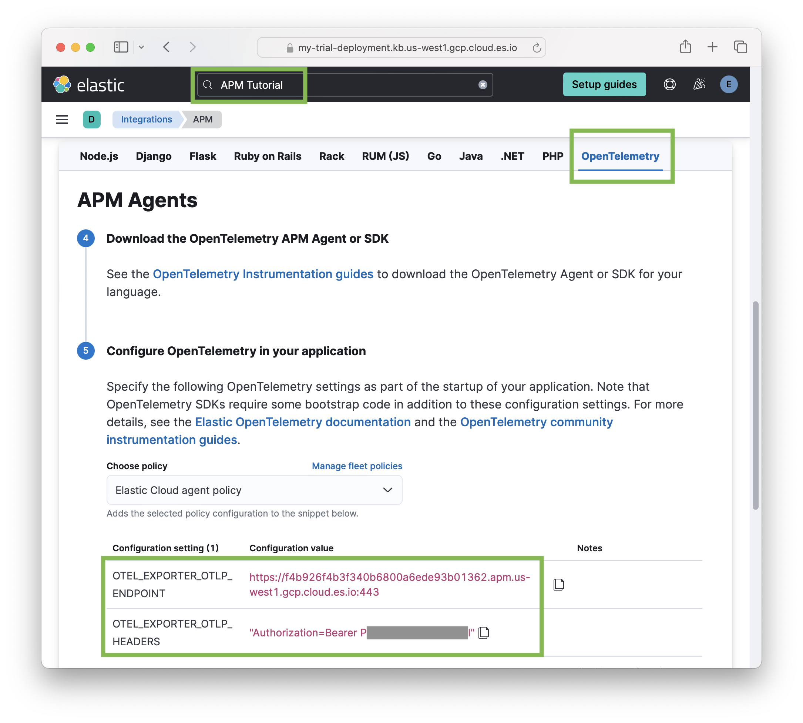

# elastic-otel-node Example

This repository holds a small Node.js app to demonstrate usage of
[`@elastic/opentelemetry-node`](https://github.com/elastic/elastic-otel-node/tree/main/packages/opentelemetry-node#readme)
(the Elastic OpenTelemetry Distribution for Node.js) in instrumenting Node.js
apps for observability.

The app is a barebones shortlinks service (add a URL with a shortname, then
use the service to redirect to that URL). This implementation uses PostgreSQL
to store shortlinks (using the `pg` client package), and `express` for the
HTTP server.


## Usage

Download and start the service (this assumes you have Docker installed):

```sh
git clone https://github.com/elastic/elastic-otel-node-example.git
cd elastic-otel-node-example
npm install

cp .env.template .env
vim .env            # See section below for configuring this file.

npm run db:start    # start Postgres in Docker and setup table(s)
npm start           # start the service at http://127.0.0.1:3000/
```

To try it out, first add a shortlink:

```sh
curl http://127.0.0.1:3000/ -X POST -d shortname=el -d url=https://elastic.co
```

Then open <http://127.0.0.1:3000/el> in your browser.

That is mostly it.  When you are done, run `npm run db:stop` to stop the
PostgreSQL container. The link data is not persisted outside of the container.
Definitely *barebones*.


## Observability with `@elastic/opentelemetry-node`

The interesting thing here is how easy it is to enable OpenTelemetry-based
observability of this app. The steps are:

1. You'll need somewhere to send the gathered OpenTelemetry data, so it can be viewed and analyzed. The `@elastic/opentelemetry-node` package supports sending to any OTLP endpoint (e.g. an OpenTelemetry collector instance). Here we will show using an [Elastic Observability](https://www.elastic.co/observability) cloud deployment.

    If you don't have an Elastic cloud deployment, you can [start a free trial](https://cloud.elastic.co/registration). After registering, click "Create deployment".  Once that is created you should visit your Kibana home page, `https://{DEPLOYMENT_NAME}.kb.{REGION}.cloud.es.io/app/home#/getting_started`.  For example:
    `https://my-deployment.kb.us-west1.gcp.cloud.es.io/app/home#/getting_started`

    To configure `@elastic/opentelemetry-node` you'll need the deployment's
    OTLP endpoint and authorization header to set the appropriate `OTLP_*`
    environment variables. You can find these in Kibana's APM tutorial.

    

    To configure the Shortlinks service, copy the ".env.template" file to ".env"
    and fill in the values for your Elastic cloud deployment. For example:

    ```
    OTEL_EXPORTER_OTLP_ENDPOINT=https://my-deployment.apm.us-west1.gcp.cloud.es.io
    OTEL_EXPORTER_OTLP_HEADERS="Authorization=Bearer P....I"
    OTEL_SERVICE_NAME=shortlinks
    ```

2. Install the Elastic OpenTelemetry Node.js distro as a dependency:

    ```sh
    npm install --save @elastic/opentelemetry-node
    ```

3. Use the Node.js [`-r, --require` option](https://nodejs.org/api/all.html#all_cli_-r---require-module) to load and start the distro:

    ```sh
    node -r @elastic/opentelemetry-node lib/app.js
    ```

If all has gone well, then after some usage, you will see telemetry data for
the shortlinks app in the "APM" section of Kibana.


